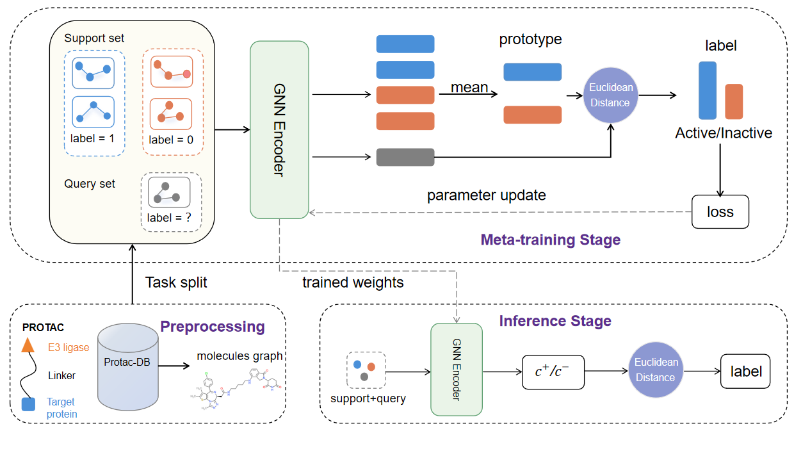
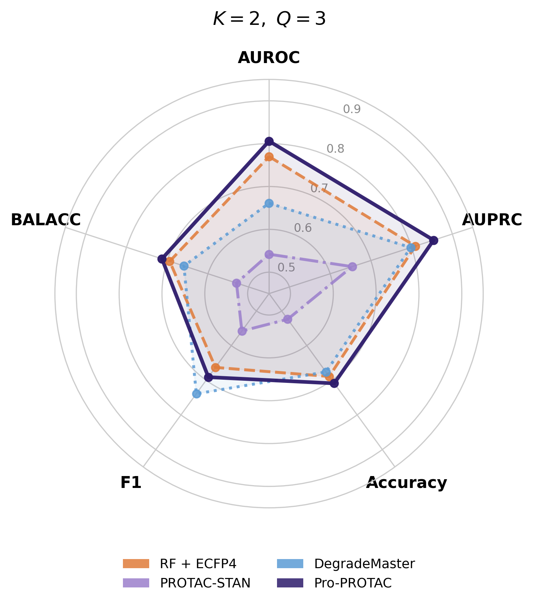

# ProMeta

**Few-shot PROTAC-targeted degradation prediction across E3 ligases**

> *Bioinformatics*, 2026 | [Paper](#) | [](https://doi.org/10.5281/zenodo.19647767)

**Authors:** Yuansheng Liu<sup>1,2</sup>, Yufei Ye<sup>1,2</sup>, Tao Tang<sup>3</sup>, Jiawei Luo<sup>1,2</sup>, Wen Tao<sup>4,\*</sup>, Xiao Luo<sup>5,\*</sup>

---

## Overview

ProMeta is a prototype-based meta-learning framework for cross-ligase PROTAC degradation activity prediction. It combines a GCN molecular encoder with a lightweight protein sequence encoder, fusing POI and E3 ligase sequence information via learnable weights for improved generalization to unseen E3 ligases.

**Key features:**
- Requires only SMILES strings and protein sequences as input — no structural data needed
- Episodic meta-training on CRBN compounds enables few-shot transfer to unseen E3 ligases
- Non-parametric prototype classification: no parameter updates at inference time
- Learnable sequence fusion: `z = z_mol + α_poi · z_poi + α_e3 · z_e3`
- Outperforms PROTAC-STAN and DegradeMaster on cross-ligase transfer benchmarks

<p align="center">
  
  <br>
  <em>Overview of the ProMeta framework. The GCN encoder is meta-trained on CRBN episodes alongside a ProteinEncoder for POI and E3 sequences, and directly transferred to unseen E3 ligases at inference time via prototype-based classification.</em>
</p>

---

## Repository Structure

```
ProMeta/
├── train.py          # Meta-training entry point
├── predict.py        # Evaluation entry point
├── models.py         # GCNEncoder and ProteinEncoder definitions
├── data.py           # Graph construction, protein index, episode sampling
├── utils.py          # Metrics (AUROC, AUPRC, F1, …) and seed utilities
├── requirements.txt  # Python dependencies
└── splits/           # Pre-generated episodic split JSON files
```

---

## Installation

```bash
# Clone the repository
git clone https://github.com/your-repo/ProMeta.git
cd ProMeta

# Create a conda environment (recommended)
conda create -n prometa python=3.9 -y
conda activate prometa

# Install PyTorch (adjust CUDA version as needed)
pip install torch==2.0.1 torchvision==0.15.2 torchaudio==2.0.0 \
    --index-url https://download.pytorch.org/whl/cu118

# Install PyTorch Geometric
pip install torch-geometric==2.3.0

# Install remaining dependencies
pip install -r requirements.txt
```

---

## Data Preparation

All processed data files and episodic splits are available on Zenodo:

[](https://doi.org/10.5281/zenodo.19647767)

```bash
# Download via zenodo_get (recommended)
pip install zenodo_get
zenodo_get 10.5281/zenodo.19647767

# Or download manually from:
# https://doi.org/10.5281/zenodo.19647767
```

Place the downloaded files in the project root:

```
protac_filtered_balanced.csv   # Preprocessed and balanced PROTAC dataset
protac.sdf                     # Molecular structures in SDF format
protac_with_seq.csv            # Protein sequences (POI_seq and E3_seq columns)
splits/                        # Episodic split JSON files
```

`protac_with_seq.csv` must contain at minimum the columns `Compound ID`, `POI_seq`, and `E3_seq`. Rows with missing sequences are skipped gracefully, falling back to molecule-only embeddings.

> The raw PROTAC-DB source is also available at [https://protacdb.com](https://protacdb.com). Our preprocessed and balanced version is provided on Zenodo.

The split files follow the naming convention:
```
splits/crbn_vhl_K2Q3_seed{42,2025,3407}.json           # CRBN→VHL, K=2 Q=3
splits/crbn_vhl_K2Q5_bootstrap_seed{42,2025,3407}.json  # CRBN→VHL, K=2 Q=5†
splits/crbn_rareE3_K1Q1_seed{42,2025,3407}.json         # Rare E3, K=1 Q=1
splits/crbn_rareE3_K2Q2_seed{42,2025,3407}.json         # Rare E3, K=2 Q=2
```

---

## Usage

Training and evaluation are split into two scripts. Run `train.py` first to meta-train and save encoder checkpoints, then `predict.py` to evaluate on the held-out split.

### ProMeta — CRBN → VHL benchmark (K=2, Q=3)

```bash
for seed in 42 2025 3407; do
    python train.py \
        --csv      protac_filtered_balanced.csv \
        --sdf      protac.sdf \
        --split    splits/crbn_vhl_K2Q3_seed${seed}.json \
        --seq-csv  protac_with_seq.csv \
        --seed     ${seed} \
        --device   cuda \
        --outdir   results/vhl_K2Q3_seed${seed}

    python predict.py \
        --csv         protac_filtered_balanced.csv \
        --sdf         protac.sdf \
        --split       splits/crbn_vhl_K2Q3_seed${seed}.json \
        --seq-csv     protac_with_seq.csv \
        --encoder     results/vhl_K2Q3_seed${seed}/encoder_seed${seed}.pt \
        --poi-encoder results/vhl_K2Q3_seed${seed}/poi_encoder_seed${seed}.pt \
        --e3-encoder  results/vhl_K2Q3_seed${seed}/e3_encoder_seed${seed}.pt \
        --seed        ${seed} \
        --device      cuda \
        --outdir      results/vhl_K2Q3_seed${seed}
done
```

### ProMeta — CRBN → VHL benchmark (K=2, Q=5†, bootstrap)

```bash
for seed in 42 2025 3407; do
    python train.py \
        --csv      protac_filtered_balanced.csv \
        --sdf      protac.sdf \
        --split    splits/crbn_vhl_K2Q5_bootstrap_seed${seed}.json \
        --seq-csv  protac_with_seq.csv \
        --meta-q   5 \
        --seed     ${seed} \
        --device   cuda \
        --outdir   results/vhl_K2Q5_seed${seed}

    python predict.py \
        --csv         protac_filtered_balanced.csv \
        --sdf         protac.sdf \
        --split       splits/crbn_vhl_K2Q5_bootstrap_seed${seed}.json \
        --seq-csv     protac_with_seq.csv \
        --encoder     results/vhl_K2Q5_seed${seed}/encoder_seed${seed}.pt \
        --poi-encoder results/vhl_K2Q5_seed${seed}/poi_encoder_seed${seed}.pt \
        --e3-encoder  results/vhl_K2Q5_seed${seed}/e3_encoder_seed${seed}.pt \
        --seed        ${seed} \
        --device      cuda \
        --outdir      results/vhl_K2Q5_seed${seed}
done
```

### ProMeta — Rare E3 ligase benchmark (one-shot, K=1 Q=1)

```bash
for seed in 42 2025 3407; do
    python train.py \
        --csv        protac_filtered_balanced.csv \
        --sdf        protac.sdf \
        --split      splits/crbn_rareE3_K1Q1_seed${seed}.json \
        --seq-csv    protac_with_seq.csv \
        --exclude-e3 rare \
        --meta-k     1 --meta-q 1 \
        --seed       ${seed} \
        --device     cuda \
        --outdir     results/rareE3_K1Q1_seed${seed}

    python predict.py \
        --csv         protac_filtered_balanced.csv \
        --sdf         protac.sdf \
        --split       splits/crbn_rareE3_K1Q1_seed${seed}.json \
        --seq-csv     protac_with_seq.csv \
        --encoder     results/rareE3_K1Q1_seed${seed}/encoder_seed${seed}.pt \
        --poi-encoder results/rareE3_K1Q1_seed${seed}/poi_encoder_seed${seed}.pt \
        --e3-encoder  results/rareE3_K1Q1_seed${seed}/e3_encoder_seed${seed}.pt \
        --meta-k      1 --meta-q 1 \
        --seed        ${seed} \
        --device      cuda \
        --outdir      results/rareE3_K1Q1_seed${seed}
done
```

### Aggregate Results Across Seeds

```python
import pandas as pd
import numpy as np

seeds   = [42, 2025, 3407]
metrics = ["AUROC", "AUPRC", "Accuracy", "F1", "BALACC"]

data = {m: [] for m in metrics}
for seed in seeds:
    df = pd.read_csv(f"results/vhl_K2Q3_seed{seed}/summary_seed{seed}.csv")
    for m in metrics:
        data[m].append(df[m].values[0])

for m in metrics:
    print(f"{m}: {np.mean(data[m]):.3f} ± {np.std(data[m]):.3f}")
```

> **Note:** After training, three checkpoints are saved per seed: `encoder_seed{N}.pt`, `poi_encoder_seed{N}.pt`, and `e3_encoder_seed{N}.pt`. The learned fusion weights α\_poi and α\_e3 are printed at the end of training.

---

## Key Hyperparameters

**`train.py`**

| Argument | Default | Description |
|---|---|---|
| `--meta-epochs` | 100 | Number of meta-training epochs |
| `--episodes-per-epoch` | 100 | Episodes sampled per epoch |
| `--meta-k` | 2 | Support samples per class |
| `--meta-q` | 3 | Query samples per class |
| `--encoder-hidden` | 128 | GCN hidden dimension |
| `--encoder-layers` | 3 | Number of GCN layers |
| `--meta-lr` | 1e-3 | Adam learning rate |
| `--seq-csv` | — | CSV with `POI_seq` and `E3_seq` columns (enables protein fusion) |
| `--prot-embed-dim` | 64 | Amino acid embedding dimension |
| `--prot-max-len` | 2000 | Max sequence length (truncated beyond this) |
| `--exclude-e3` | `VHL` | E3 ligase(s) held out as test set; use `rare` for rare E3 benchmark |

**`predict.py`**

| Argument | Default | Description |
|---|---|---|
| `--encoder` | — | Path to `encoder_seed{N}.pt` |
| `--poi-encoder` | — | Path to `poi_encoder_seed{N}.pt` |
| `--e3-encoder` | — | Path to `e3_encoder_seed{N}.pt` |
| `--phase` | `meta_test` | Split phase to evaluate on |

---

## Results

### CRBN → VHL Transfer Benchmark

| Setting | Method | AUROC | AUPRC | Accuracy | F1 | BALACC |
|---|---|---|---|---|---|---|
| **K=2, Q=3** | RF + ECFP4 | 0.770 ± 0.017 | 0.827 ± 0.013 | 0.689 ± 0.011 | 0.663 ± 0.012 | 0.694 ± 0.012 |
| | GNN | 0.762 ± 0.012 | 0.816 ± 0.008 | 0.662 ± 0.014 | 0.617 ± 0.012 | 0.668 ± 0.014 |
| | PROTAC-STAN | 0.542 ± 0.030 | 0.654 ± 0.025 | 0.524 ± 0.029 | 0.558 ± 0.039 | 0.530 ± 0.027 |
| | DegradeMaster | 0.661 ± 0.033 | 0.798 ± 0.035 | 0.676 ± 0.016 | **0.739 ± 0.018** | 0.659 ± 0.019 |
| | **ProMeta** | **0.787 ± 0.032** | **0.836 ± 0.021** | **0.709 ± 0.035** | 0.692 ± 0.038 | **0.708 ± 0.035** |
| **K=2, Q=5†** | RF + ECFP4 | 0.739 ± 0.018 | 0.820 ± 0.008 | 0.657 ± 0.011 | 0.657 ± 0.012 | 0.660 ± 0.011 |
| | GNN | 0.749 ± 0.025 | 0.806 ± 0.012 | 0.658 ± 0.003 | 0.616 ± 0.007 | 0.663 ± 0.004 |
| | PROTAC-STAN | 0.552 ± 0.019 | 0.672 ± 0.013 | 0.524 ± 0.029 | 0.564 ± 0.036 | 0.530 ± 0.028 |
| | DegradeMaster | 0.522 ± 0.029 | 0.759 ± 0.030 | 0.664 ± 0.014 | **0.734 ± 0.011** | 0.592 ± 0.007 |
| | **ProMeta** | **0.790 ± 0.007** | **0.837 ± 0.010** | **0.693 ± 0.006** | 0.684 ± 0.017 | **0.696 ± 0.005** |

† Bootstrap sampling used for query set construction.

<p align="center">
  
  <br>
  <em>Radar chart comparison on the CRBN→VHL benchmark (K=2, Q=3). ProMeta achieves the largest area across AUROC, AUPRC, Accuracy, and BALACC.</em>
</p>

### Rare E3 Ligase Benchmark

| Setting | Method | AUROC | AUPRC | Accuracy | F1 | BALACC |
|---|---|---|---|---|---|---|
| **K=1, Q=1** | PROTAC-STAN | 0.543 ± 0.047 | 0.757 ± 0.032 | 0.536 ± 0.025 | **0.603 ± 0.079** | 0.536 ± 0.025 |
| | DegradeMaster | 0.651 ± 0.461 | 0.671 ± 0.234 | 0.500 ± 0.259 | 0.597 ± 0.390 | 0.508 ± 0.257 |
| | **ProMeta** | **0.752 ± 0.010** | **0.876 ± 0.005** | **0.653 ± 0.085** | 0.598 ± 0.163 | **0.653 ± 0.085** |
| **K=2, Q=2** | PROTAC-STAN | 0.593 ± 0.139 | 0.646 ± 0.084 | 0.513 ± 0.041 | 0.529 ± 0.032 | 0.513 ± 0.041 |
| | DegradeMaster | 0.602 ± 0.300 | **0.791 ± 0.161** | **0.656 ± 0.204** | **0.605 ± 0.238** | **0.657 ± 0.205** |
| | **ProMeta** | **0.656 ± 0.029** | 0.782 ± 0.018 | 0.594 ± 0.056 | 0.513 ± 0.070 | 0.594 ± 0.056 |

---

## Citation

If you use ProMeta in your research, please cite our paper (citation will be updated upon publication):

> Yuansheng Liu, Yufei Ye, Tao Tang, Jiawei Luo, Wen Tao, Xiao Luo.
> *ProMeta: Few-shot PROTAC-targeted degradation prediction across E3 ligases.*
> Manuscript in preparation, 2026.

---

## License

This project is licensed under the MIT License.
